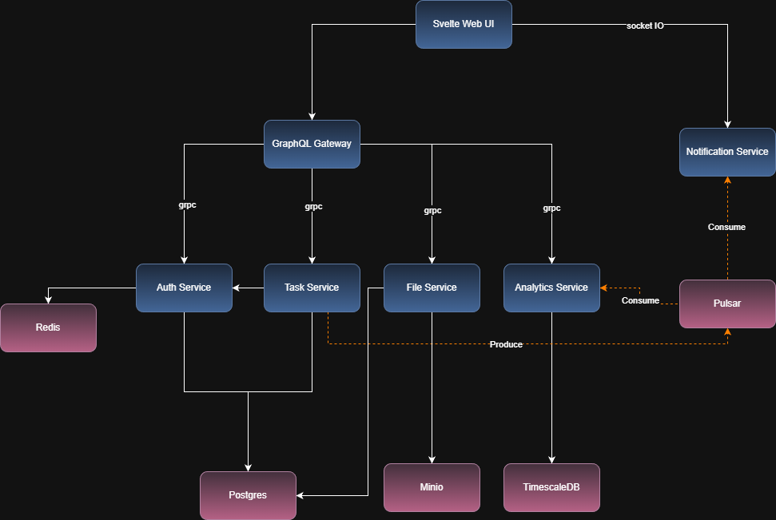

# 📋 Task Management - Project Overview

> A comprehensive showcase project task management platform built with microservices architecture, featuring real-time notifications, analytics, and file management capabilities.

---

## 🎯 Project Description

**Task Management** is a modern, scalable task management system designed using a microservices architecture. The platform enables users to create, manage, and track tasks with real-time notifications, analytics insights, and file attachments. Built with TypeScript, NestJS, SvelteKit and deployed on Kubernetes, this project demonstrates production-ready microservices patterns.

## 🤝 Contributing

This is a personal learning project, created for educational purposes!

---

## 🏗️ Architecture

### Microservices Architecture

The platform follows a **decoupled microservices pattern** with gRPC for inter-service communication, WebSocket for realtime notification and GraphQL for client-facing APIs:


### Technology Stack

#### Core Technologies
- **Language**: TypeScript 5.9.2
- **Runtime**: Node.js >= 18
- **Monorepo Tool**: Turborepo 2.5.8
- **Package Manager**: npm 11.5.1
- **Framework**: NestJS
- **API Protocol**: gRPC + GraphQL
- **Realtime communication**: WebSocket
- **Frontend**: Svelte with TailwindCSS

#### Databases
- **PostgreSQL**: Primary database for Auth, Task, and File services
- **TimescaleDB**: Time-series database for Analytics
- **Redis**: Session management and caching

#### Infrastructure
- **Message Broker**: Apache Pulsar
- **Object Storage**: MinIO (S3-compatible)
- **Container Orchestration**: Kubernetes (Minikube/Vultr)
- **Container Runtime**: Docker

---

## 📦 Services Overview

### 1. **Auth Service** (Port: 4000/5000)

Authentication and authorization service managing user identity and access control.

**Key Features:**
- User registration and authentication
- JWT-based token system (access + refresh tokens)
- Token rotation and family tracking
- Device and session management
- Redis-backed session storage
- Bull Queue for token cleanup jobs

**Tech Stack:** NestJS, Prisma, PostgreSQL, Redis, gRPC, JWT, Bull Queue

**Schema:** `auth` schema in PostgreSQL

---

### 2. **Task Service** (Port: 4001/5001)

Core task management service handling CRUD operations for tasks.

**Key Features:**
- Complete task lifecycle management (Create, Read, Update, Delete)
- Task assignment to users
- Status tracking (TODO, IN_PROGRESS, REVIEW, DONE, CANCELLED)
- Priority levels (LOW, MEDIUM, HIGH, URGENT)
- Due date tracking
- User-based task filtering
- Pagination support
- Event publishing to Pulsar

**Tech Stack:** NestJS, Prisma, PostgreSQL, gRPC, Apache Pulsar

**Schema:** `task` schema in PostgreSQL

---

### 3. **File Service** (Port: 4006/50046)

File management service for handling uploads, downloads, and attachments.

**Key Features:**
- File upload with validation (type, size)
- File download with presigned URLs
- Image thumbnail generation (Sharp)
- File deletion with authorization
- MinIO/S3 integration
- File metadata storage
- Task-file association
- RESTful HTTP endpoints + gRPC API

**Tech Stack:** NestJS, Prisma, PostgreSQL, MinIO, Sharp, gRPC

**Schema:** `file` schema in PostgreSQL  
**Storage:** MinIO bucket `task-files`

---

### 4. **Analytics Service** (Port: 4005/5005)

Analytics and metrics service for tracking task completion and user productivity.

**Key Features:**
- Task completion metrics
- User productivity statistics
- Time-series data aggregation
- Real-time event processing via Pulsar

**Tech Stack:** NestJS, Prisma, TimescaleDB, gRPC, Apache Pulsar

**Schema:** `analytics` schema in TimescaleDB

---

### 5. **Notification Service** (Port: 4004)

Real-time notification service for user alerts and updates.

**Key Features:**
- Real-time notifications via WebSocket
- Event-driven architecture (Pulsar consumer)
- WebSocket connection management
- Redis-backed pub/sub

**Tech Stack:** NestJS, Redis, Apache Pulsar, WebSocket

---

### 6. **GraphQL Gateway** (Port: 4002)

API Gateway providing a unified GraphQL interface to all backend services.

**Key Features:**
- GraphQL schema federation
- gRPC client aggregation
- Request authentication and authorization
- Cookie-based session management
- Cross-service query orchestration
- Error handling and transformation

**Tech Stack:** NestJS, GraphQL, gRPC clients

**Connected Services:**
- Auth Service (auth-service:5000)
- Task Service (task-service:5001)
- Analytics Service (analytics-service:5005)
- File Service (file-service:50046)

---

### 7. **Svelte Web** (Port: 4003)

Modern, reactive web application providing the user interface.

**Key Features:**
- Reactive UI with Svelte
- TailwindCSS styling
- GraphQL client integration
- Real-time notification display
- Task management interface
- File upload/download UI
- User authentication flows

**Tech Stack:** Svelte, TailwindCSS, Vite, GraphQL Client

---

## 🚀 Getting Started

### Prerequisites

- **Node.js** >= 18
- **Docker** and **Docker Compose**
- **Minikube** (for local Kubernetes)
- **kubectl** (for Kubernetes management)

### Local Development with Docker Compose

1. **Clone the repository**
   ```bash
   cd task-management-monorepo
   ```

2. **Install dependencies**
   ```bash
   npm install
   ```

3. **Start infrastructure services**
   ```bash
   docker-compose -f docker-compose.local.yaml up -d
   ```

4. **Start all services**
   ```bash
   npm run dev
   ```

6. **Access the application**

### Docker Compose Deployment

```bash
# Build and start all services
docker-compose up --build

# Stop all services and remove all volumes
docker-compose down -v
```

---

## ☸️ Kubernetes Deployment

### Local Development (Minikube)

1. **Install tools**
   ```powershell
   choco install minikube kubernetes-cli -y
   ```

2. **Start Minikube**
   ```powershell
   minikube start --driver=docker --cpus=6 --memory=8192 --disk-size=50g
   minikube addons enable ingress
   minikube addons enable metrics-server
   ```

3. **Setup secrets**
   ```powershell
   cd k8s
   .\scripts\setup-secrets.ps1 -UseDefaults
   ```

4. **Deploy application**
   ```powershell
   .\scripts\deploy-all.ps1 -WaitForReady
   ```

5. **Access via Ingress**
   ```powershell
   # Add hosts entry (run as Administrator)
   Add-Content C:\Windows\System32\drivers\etc\hosts "127.0.0.1 task-platform.local"
   Add-Content C:\Windows\System32\drivers\etc\hosts "127.0.0.1 api.task-platform.local"
   
   # Start tunnel
   minikube tunnel
   ```
   
   Open browser: http://task-platform.local

### Production Deployment (Vultr Kubernetes)

See [k8s/DEPLOY_README.md](k8s/DEPLOY_README.md) for detailed instructions on deploying to Vultr Kubernetes Engine.

---

## 🔐 Security

### Secrets Management

The project uses Kubernetes Secrets for sensitive data. See [k8s/SECRETS_README.md](k8s/SECRETS_README.md) for details.

**Infrastructure Secrets:**
- `postgres-secret`: PostgreSQL credentials
- `timescaledb-secret`: TimescaleDB credentials
- `minio-secret`: MinIO access credentials

**Application Secrets:**
- `auth-service-secret`: Database URL, JWT secret
- `task-service-secret`: Database URL
- `file-service-secret`: Database URL, MinIO keys
- `analytics-service-secret`: Database URL

---

## 🛠️ Development Tools

### Turborepo Commands

```bash
# Build all packages and apps
npm run build

# Run all services in development
npm run dev

# Lint all packages
npm run lint

# Format code
npm run format

# Type checking
npm run check-types
```

### Service-Specific Commands

```bash
# Build specific service
turbo build --filter=auth-service

# Run specific service
turbo dev --filter=task-service

# Run Prisma migrations
turbo prisma:migrate
```

### Kubernetes Management

```bash
# View all pods
kubectl get pods -A

# View logs
kubectl logs -f deployment/auth-service -n task-platform-apps

# Execute command in pod
kubectl exec -it deployment/auth-service -n task-platform-apps -- /bin/sh

# Restart deployment
kubectl rollout restart deployment/auth-service -n task-platform-apps

# Check deployment status
.\k8s\scripts\status.ps1
```

---

## 📈 Service Communication

### gRPC Services

All backend services communicate via gRPC for high-performance, type-safe communication:

- **Auth Service**: User authentication and authorization
- **Task Service**: Task management operations
- **File Service**: File operations
- **Analytics Service**: Metrics and analytics queries

### Event-Driven Communication

Apache Pulsar enables asynchronous event processing:

- **Task Events**: Task creation, updates, completion
- **Analytics Events**: Metrics collection and aggregation
- **Notification Events**: Real-time user notifications

### Client Communication

- **GraphQL**: Unified API for web and mobile clients
- **WebSocket**: Real-time notifications via Notification Service

---

## 🧪 Testing

Each service includes:
- Unit tests
- Integration tests
- E2E tests (for web application)

```bash
# Run all tests
npm run test

# Run tests for specific service
turbo test --filter=auth-service
```

---

## 🌐 Environments

### Development
- Local Docker Compose setup
- Hot reload enabled
- Debug logging
- Default credentials

### Staging
- Minikube Kubernetes cluster
- Similar to production configuration

### Production
- Vultr Kubernetes Engine
- Production-grade secrets
- Auto-scaling with HPA

---

## 📝 API Documentation

### GraphQL Gateway
Access GraphQL Playground at: http://localhost:4002/graphql

### gRPC Services
Proto definitions available in: `packages/grpc/proto/`

---

## 📚 Additional Documentation

- [Kubernetes Quick Start](k8s/README.md)
- [Production Deployment Guide](k8s/DEPLOY_README.md)
- [Secrets Management](k8s/SECRETS_README.md)
- [Auth Service Documentation](apps/auth-service/README.md)
- [Task Service Documentation](apps/task-service/README.md)
- [File Service Documentation](apps/file-service/README.md)
- [Analytics Service Documentation](apps/analytics-service/README.md)

---

## 👨‍💻 Developer

Created as a learning project for understanding microservices architecture, Kubernetes deployment, and modern web development practices.

**Tech Stack Highlights:**
- ✅ Microservices Architecture
- ✅ gRPC Communication
- ✅ Event-Driven Design
- ✅ Kubernetes Orchestration
- ✅ Real-time Notifications
- ✅ Time-Series Analytics
- ✅ Object Storage Integration
- ✅ GraphQL API Gateway
- ✅ Monorepo with Turborepo
- ✅ TypeScript End-to-End

---
